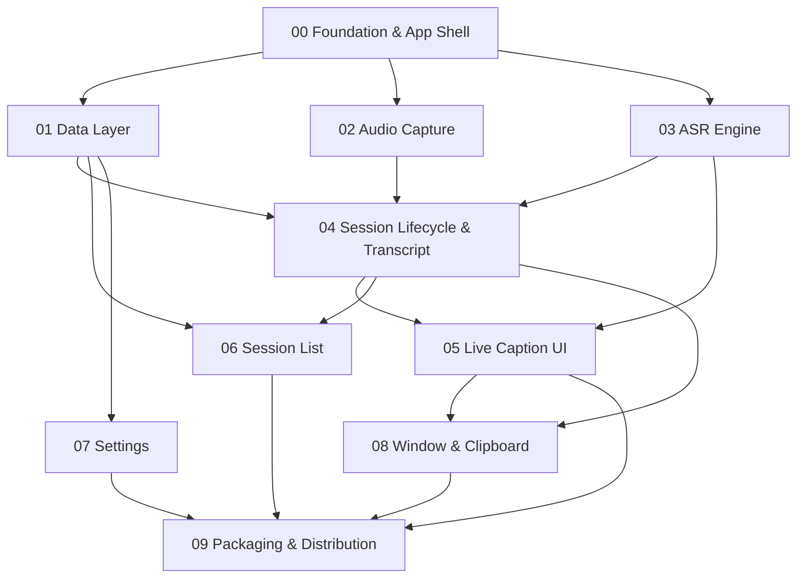

# Local Caption — Spec Index & Build Sequence

The full design lives in [`../SPEC.md`](../SPEC.md) (v2.0). This folder splits it into
**10 buildable sub-specs**. Each sub-spec states *what should be done*, *what is done*,
and *blockers*. Build in the sequence below.

**Product in one line:** native macOS (Swift/SwiftUI + WhisperKit) app that captions
**system/call audio** live, fully on-device, and auto-saves transcripts.

---

## Status at a glance

**Phases 1–5 are built and shipping** (in `../app/`): the app builds, captions, saves,
recovers, and is locally signed; **35 unit tests** pass. The authoritative build state is
**[STATUS.md](STATUS.md)**. Only notarized distribution (09) and the new Live AI Summary
(10) remain.

Legend: ✅ done · 🟢 mostly · 🟡 partial · 🔴 barely · ⬜ not started

| # | Spec | Status | Remaining |
|---|------|--------|-----------|
| 00 | [Foundation & App Shell](SPEC-00-foundation.md) | ✅ done | — |
| 01 | [Data Layer (Config + SQLite)](SPEC-01-data-layer.md) | ✅ done | — |
| 02 | [Audio Capture (system audio)](SPEC-02-audio-capture.md) | ✅ done | — |
| 03 | [ASR Engine & Streaming](SPEC-03-asr-engine.md) | ✅ done | real-audio WER pass (SPEC §19) |
| 04 | [Session Lifecycle & Transcript](SPEC-04-session-transcript.md) | ✅ done | — |
| 05 | [Live Caption UI](SPEC-05-caption-ui.md) | ✅ done | — |
| 06 | [Session List & Management](SPEC-06-session-list.md) | ✅ done | — |
| 07 | [Settings](SPEC-07-settings.md) | ✅ done | — |
| 08 | [Window & Clipboard](SPEC-08-window-clipboard.md) | ✅ done | auto-copy-on-selection (needs AppKit text view) |
| 09 | [Packaging & Distribution](SPEC-09-packaging.md) | 🟡 partial | Developer ID, notarize, DMG — blocked on **B2** |
| 10 | [Live AI Summary (on-device)](SPEC-10-live-summary.md) | ⬜ not started | on-device MLX LLM, summary card every ~100 words, right-side "Key points" panel |

**Built:** the Python **spike** (`../spike/`) that proved the ASR architecture, the
**minimal app** (`../minimal/`) vertical slice, and the **full app** (`../app/`, Phases 1–5).
Remaining work: **[SEQUENCE.md](SEQUENCE.md)**; shipped-state detail: **[STATUS.md](STATUS.md)**.

---

## Cross-cutting blockers (resolve these first)

| ID | Blocker | Blocks | Status |
|----|---------|--------|--------|
| **B1** | Full Xcode not installed | Every Swift spec | ✅ **Resolved** — Xcode 16.2 installed |
| **B3** | Capture method: BlackHole vs ScreenCaptureKit | 02, permissions | ✅ **Resolved** — ScreenCaptureKit |
| **B4** | ASR: hybrid vs single-model streaming | 03 | ✅ **Resolved** — dual-model hybrid (tiny.en + small.en) shipped |
| **B2** | Apple Developer account + Developer ID cert | 09 (notarization) | ⛔ Still needed for Phase 6 only |
| **B5** | Product decisions (journal encryption, JSON sidecar, bundled model, min-OS) — SPEC.md §22 | 04, 09 | ✅ Resolved in Phase 2 |
| **B6–B8** | Local-LLM memory pressure · latency > cadence · summary quality | 10 | New — see [SPEC-10](SPEC-10-live-summary.md) |

Only **B2** blocks shipped phases (distribution). Spec 10 introduces its own risks (B6–B8).

---

## Build sequence

**Phase A — Scaffold:** `00` → then `01` (config + DB) alongside it.
**Phase B — Core pipeline:** `02` (audio) and `03` (ASR) in parallel → `04` (glue: lifecycle + transcript + journal).
**Phase C — UI:** `05` (caption view) → `06` (session list) and `07` (settings) in parallel.
**Phase D — Polish:** `08` (window + clipboard).
**Phase E — Ship:** `09` (sign, notarize, DMG).

**Critical path:** `00 → 03 → 04 → 05 → 09`. Get `03` (ASR) right first — it's the
product's core and the only part already de-risked.

**Recommended first milestone (vertical slice):** `00 + 02 + 03 + 04 + 05` = "audio in →
live captions on screen." Everything else (list, settings, window, clipboard, packaging)
layers onto that working core.
