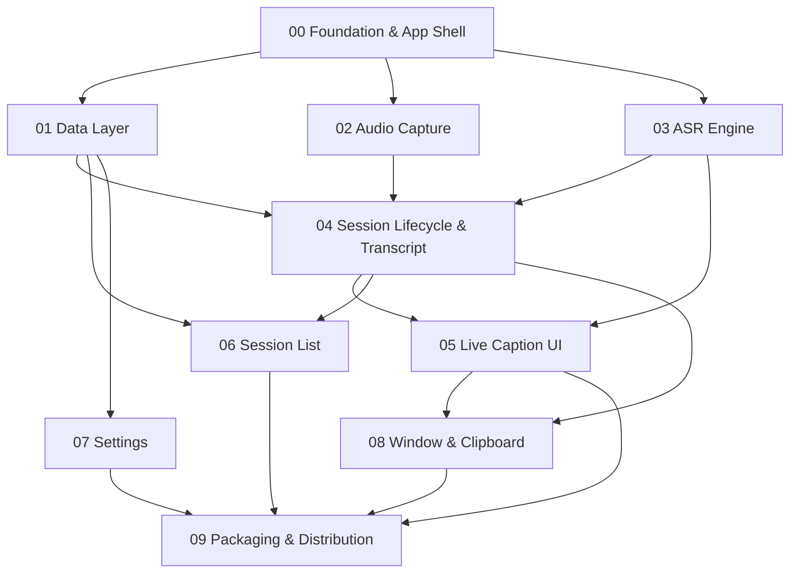

# Local Caption — Spec Index & Build Sequence

The full design lives in [`../SPEC.md`](../SPEC.md) (v2.0). This folder splits it into
**10 buildable sub-specs**. Each sub-spec states *what should be done*, *what is done*,
and *blockers*. Build in the sequence below.

**Product in one line:** native macOS (Swift/SwiftUI + WhisperKit) app that captions
**system/call audio** live, fully on-device, and auto-saves transcripts.

---

## Status at a glance

| # | Spec | Status | Hard blocker |
|---|------|--------|--------------|
| 00 | [Foundation & App Shell](SPEC-00-foundation.md) | Not started | Xcode |
| 01 | [Data Layer (Config + SQLite)](SPEC-01-data-layer.md) | Not started | Xcode |
| 02 | [Audio Capture (system audio)](SPEC-02-audio-capture.md) | Design + spike learnings | Xcode · capture-method decision |
| 03 | [ASR Engine & Streaming](SPEC-03-asr-engine.md) | **Architecture validated by spike** | Xcode (WhisperKit) |
| 04 | [Session Lifecycle & Transcript](SPEC-04-session-transcript.md) | Not started | depends on 02/03 |
| 05 | [Live Caption UI](SPEC-05-caption-ui.md) | Not started | depends on 03/04 |
| 06 | [Session List & Management](SPEC-06-session-list.md) | Not started | depends on 01/04 |
| 07 | [Settings](SPEC-07-settings.md) | Not started | depends on 01 |
| 08 | [Window & Clipboard](SPEC-08-window-clipboard.md) | Clipboard filters validated (spike) | depends on 04/05 |
| 09 | [Packaging & Distribution](SPEC-09-packaging.md) | Not started | Apple Developer cert |

**Nothing production is built yet.** What exists is the Python **spike** (`../spike/`)
that proved the ASR architecture, latency, and filters — see SPEC-03 / SPEC-08.

---

## Cross-cutting blockers (resolve these first)

| ID | Blocker | Blocks | Owner action |
|----|---------|--------|--------------|
| **B1** | **Full Xcode not installed** (this Mac has only Command Line Tools; its SwiftPM is broken — trivial packages fail to link) | Every Swift spec (00–09) | Install Xcode from App Store |
| **B2** | **Apple Developer account + Developer ID cert** | 09 (signing/notarization) | Enroll / obtain cert |
| **B3** | **Capture method: BlackHole vs ScreenCaptureKit** (SPEC.md §22.1) | 02, and 07/09 (permissions) | Product decision |
| **B4** | **ASR: hybrid vs turbo-only streaming** (SPEC.md §22.2) | 03 | Decide after measuring WhisperKit on ANE |
| **B5** | **4 remaining product decisions** (journal encryption, JSON sidecar, bundled model, min-OS) — SPEC.md §22.3–6 | 04, 09 | Product decisions |

---

## Build sequence

**Phase A — Scaffold:** `00` → then `01` (config + DB) alongside it.
**Phase B — Core pipeline:** `02` (audio) and `03` (ASR) in parallel → `04` (glue: lifecycle + transcript + journal).
**Phase C — UI:** `05` (caption view) → `06` (session list) and `07` (settings) in parallel.
**Phase D — Polish:** `08` (window + clipboard).
**Phase E — Ship:** `09` (sign, notarize, DMG).

**Critical path:** `00 → 03 → 04 → 05 → 09`. Get `03` (ASR) right first — it's the
product's core and the only part already de-risked.

**Recommended first milestone (vertical slice):** `00 + 02 + 03 + 04 + 05` = "audio in →
live captions on screen." Everything else (list, settings, window, clipboard, packaging)
layers onto that working core.
