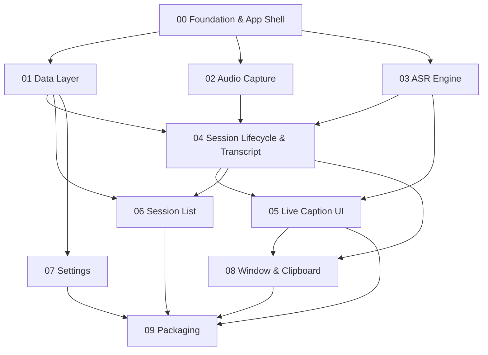

# Local Caption — Build Sequence

Standalone build order for the 10 sub-specs in this folder. For each spec's
*what-should-be-done / done / blockers*, open the linked file.

Project: native macOS (Swift/SwiftUI + WhisperKit), system-audio-only, on-device.

---

## Dependency graph



---

## Ordered plan

### Phase A — Scaffold
1. **[SPEC-00 Foundation & App Shell](SPEC-00-foundation.md)** — Xcode project, SwiftUI nav, WhisperKit+GRDB deps, Info.plist, App Support dirs. *Everything depends on this.*
2. **[SPEC-01 Data Layer](SPEC-01-data-layer.md)** — versioned config store + SQLite sessions table. *No deps beyond 00; build alongside it.*

### Phase B — Core pipeline (the product)
3. **[SPEC-02 Audio Capture](SPEC-02-audio-capture.md)** — system audio → 16 kHz mono frames. *Needs capture-method decision (B3).*
4. **[SPEC-03 ASR Engine & Streaming](SPEC-03-asr-engine.md)** — WhisperKit dual-model hybrid, LocalAgreement-2, filters. *Build against file fixtures in parallel with 02. **Already de-risked by the spike.***
5. **[SPEC-04 Session Lifecycle & Transcript](SPEC-04-session-transcript.md)** — state machine + in-memory transcript + crash-recovery journal + file/DB writing. *Glues 01+02+03.*

### Phase C — UI
6. **[SPEC-05 Live Caption UI](SPEC-05-caption-ui.md)** — Active Session screen, interim/final rendering, auto-scroll. *Needs 03+04.*
7. **[SPEC-06 Session List & Management](SPEC-06-session-list.md)** — list/create/open/rename/delete/search/sort. *Needs 01+04; parallel with 07.*
8. **[SPEC-07 Settings](SPEC-07-settings.md)** — settings UI bound to config. *Needs 01; parallel with 06.*

### Phase D — Polish
9. **[SPEC-08 Window & Clipboard](SPEC-08-window-clipboard.md)** — always-on-top/opacity + opt-in clipboard. *Needs 04+05.*

### Phase E — Ship
10. **[SPEC-09 Packaging & Distribution](SPEC-09-packaging.md)** — codesign, notarize, DMG, offline audit. *Needs everything + Developer cert (B2).*

---

## Critical path

```
00 → 03 → 04 → 05 → 09
```
Get **03 (ASR)** right first — it is the core and the only part already proven.

## First milestone (recommended vertical slice)

```
00 + 02 + 03 + 04 + 05  =  "audio in → live captions on screen"
```
Ship this working core, then layer on 06 (list), 07 (settings), 08 (polish), 09 (packaging).

---

## Blockers gating the start

| ID | Blocker | Unblocks | Action |
|----|---------|----------|--------|
| **B1** | Full Xcode not installed (CLT SwiftPM broken) | 00–09 (all Swift work) | Install Xcode |
| **B3** | Capture method: BlackHole vs ScreenCaptureKit | 02, 07, 09 | Product decision |
| **B4** | ASR: hybrid vs turbo-only streaming | 03 | Decide after measuring WhisperKit on ANE |
| **B2** | Apple Developer cert | 09 | Enroll |
| **B5** | 4 minor product decisions (SPEC.md §22.3–6) | 04, 09 | Product decisions |

**To begin:** resolve **B1** + **B3**, then start Phase A.
