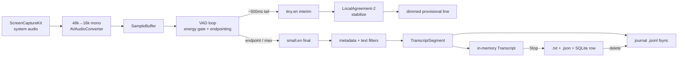

# LocalCaption — Implementation Status & Architecture

Native macOS app that live-captions **system/call audio** fully on-device (Swift/SwiftUI +
WhisperKit), and auto-saves transcripts. This document reflects what is actually built in
`app/`. The product spec is [`../SPEC.md`](../SPEC.md); the phase plan is
[`SEQUENCE.md`](SEQUENCE.md).

---

## Status at a glance

| Phase | Area | Status |
|------|------|--------|
| 1 | Foundation: nav shell, config, SQLite, App Support bootstrap | ✅ Done |
| 2 | Session lifecycle, transcript save (`.txt`+`.json`), crash-recovery journal | ✅ Done |
| 3 | Session list (open/rename/delete/search/sort) + full Settings | ✅ Done |
| 4 | Dual-model ASR hybrid, LocalAgreement-2, metadata filters | ✅ Done |
| 5 | Always-on-top overlay, opacity, window memory, clipboard | ✅ Done |
| 6 | Developer ID signing + notarization + DMG | ⛔ Blocked on Apple Developer account (B2) |

**Everything functional is built.** The app builds, runs, captions, saves, recovers, and is
locally signed. The only remaining work is notarized distribution.

Verification: `swift build` clean; **35 unit tests** pass (`swift test`) covering the whole
data/logic layer. Live captioning verified manually.

---

## Key decisions (resolved blockers)

- **Capture = ScreenCaptureKit** (not BlackHole). Native system-audio capture; needs the
  **Screen Recording** permission, no third-party install, no microphone permission.
- **ASR = dual-model hybrid**, settled by an on-device benchmark (CPU+GPU, 7 s clip):
  tiny.en ≈ 456 ms, small.en ≈ 2.06 s, large-v3-turbo ≈ 3.53 s. → **tiny.en partials +
  small.en finals** by default; large-v3-turbo is an opt-in accuracy mode.
- **Build system = SwiftPM** (no Xcode project). Builds, bundles, and locally signs via
  `run.sh` with a stable self-signed identity (so macOS keeps the Screen Recording grant
  across rebuilds).
- **On-device only.** The sole network use is the one-time model download; nothing else
  leaves the machine.

---

## Package layout

Two SwiftPM targets keep the testable logic separate from the UI/ML.

```
app/
├── Package.swift
├── run.sh                     build → bundle → sign → launch
├── scripts/setup-signing.sh   one-time stable signing identity
├── Sources/
│   ├── LocalCaptionKit/       ← pure data/logic library (unit-tested, no SwiftUI/WhisperKit)
│   ├── LocalCaption/          ← the SwiftUI app: audio, ASR, session, UI
│   └── Benchmark/             ← dev-only on-device ASR benchmark (not shipped)
└── Tests/LocalCaptionKitTests/
```

### `LocalCaptionKit` (library — 35 tests target this)

| File | Responsibility |
|------|----------------|
| `AppPaths` | Application Support layout + first-launch bootstrap |
| `Config` | Versioned JSON config (schema 2): load, merge-defaults, corrupt→backup+repair, atomic write |
| `SessionRecord` / `Store` | SQLite (GRDB) session metadata; WAL; migrations; CRUD + search/sort |
| `Transcript` / `TranscriptSegment` | In-memory transcript model + `.txt` formatting |
| `TranscriptWriter` | Writes `.txt` + `.json` sidecar with ` (2)` collision suffixes |
| `Journal` | Append-only `.jsonl` crash-recovery log + recovery scan |
| `SessionFiles` | Delete a transcript's `.txt` + `.json` together |
| `Filters` | Text cleanup, hallucination blocklist, metadata quality gate (§8.3) |
| `LocalAgreement` | LocalAgreement-2 interim stabilization |
| `Sentences` | Sentence split + last-N (for clipboard) |
| `TimeFormat` | Clock / filename / ISO date formatting |

### `LocalCaption` (executable — the app)

| File | Responsibility |
|------|----------------|
| `LocalCaptionApp` / `AppEnvironment` | `@main`; owns config store + DB; recovery scan on launch |
| `Audio/SystemAudioCapture` | ScreenCaptureKit stream → 48k stereo → 16k mono Float32 |
| `ASR/WhisperEngine` | Dual resident WhisperKit models (interim + final); cache-aware download/load; metadata filtering |
| `ASR/StreamingOrchestrator` | VAD endpointing loop; interim/final routing; LocalAgreement-2; sample-based timing |
| `Session/SessionController` | State machine; owns transcript + journal + clock; save-on-stop; clipboard |
| `UI/*` | Root nav, session list, active session + controls, read-only viewer, settings, recovery, window overlay |

---

## How it works (data flow)



- **Interim track:** every ~500 ms the recent tail is decoded by **tiny.en** (~0.45 s),
  stabilized by LocalAgreement-2, shown as a dimmed provisional line (never saved).
- **Final track:** on a silence endpoint (or max-utterance cap) the utterance is decoded by
  **small.en** (~2 s), filtered, appended as a committed segment, and journaled.
- **Timing** is sample-based and pause-aware (the clock freezes while paused).

### Session state machine (SPEC §11)

`READY → RECORDING ⇄ PAUSED → STOPPING → SAVED`. Pause finalizes the in-flight utterance and
freezes the clock; Stop finalizes, writes `.txt` + `.json` + a DB row, and deletes the
journal. `duration_seconds` excludes paused time.

---

## On-disk data (`~/Library/Application Support/LocalCaption/`)

```
config.json              versioned settings (schema 2)
localcaption.db          SQLite session metadata (WAL)
transcripts/             <start>.txt  +  <start>.json  (saved on Stop)
journal/<session>.jsonl  crash-recovery log (deleted on clean Stop)
models/                  WhisperKit CoreML weights (downloaded once)
```

Transcript text lives only in the files — never in SQLite. Raw audio is discarded after
inference. Nothing is transmitted off-device.

---

## Settings (persisted, live where safe)

General (transcript folder, name prefix) · Caption (font, auto-scroll, timestamps) · Audio
(VAD sensitivity) · ASR (endpoint silence, max utterance, interim/final model) · Window
(always-on-top, opacity) · Clipboard (auto-update, N, auto-copy selection). Font/opacity/
always-on-top apply live; ASR timing/VAD apply on next Start; model changes apply on next
Start (re-loads models).

---

## Known limitations / deferred

- **WER on real audio is unvalidated.** small.en vs large-v3-turbo was compared only on clean
  TTS; both were perfect there. Turbo is the opt-in for hard/noisy audio (SPEC §19 WER pass
  still outstanding).
- **Auto-copy-selection** (selecting text auto-copies) is not wired — it needs an AppKit text
  view rather than SwiftUI `Text`. Manual "Copy last N" and auto-update both work.
- **Not notarized** (Phase 6 / B2). Runs locally via a stable self-signed identity; would show
  a Gatekeeper prompt if copied to another Mac.
- **Model change requires restarting the session** (models load at Start).
- **Diarization / multi-language / mic capture** are non-goals (SPEC §3.2).
